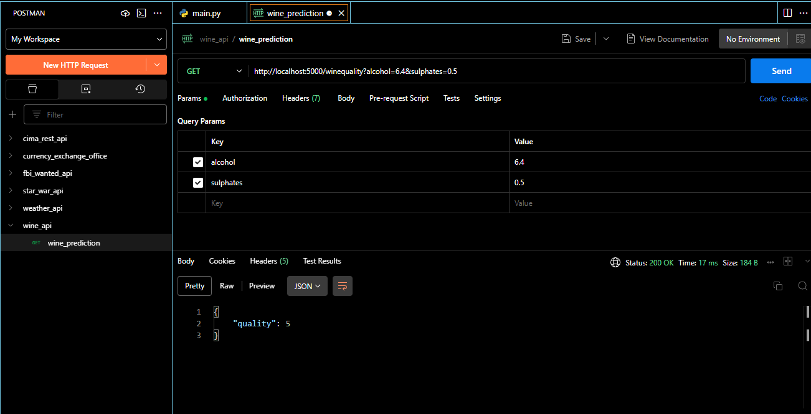
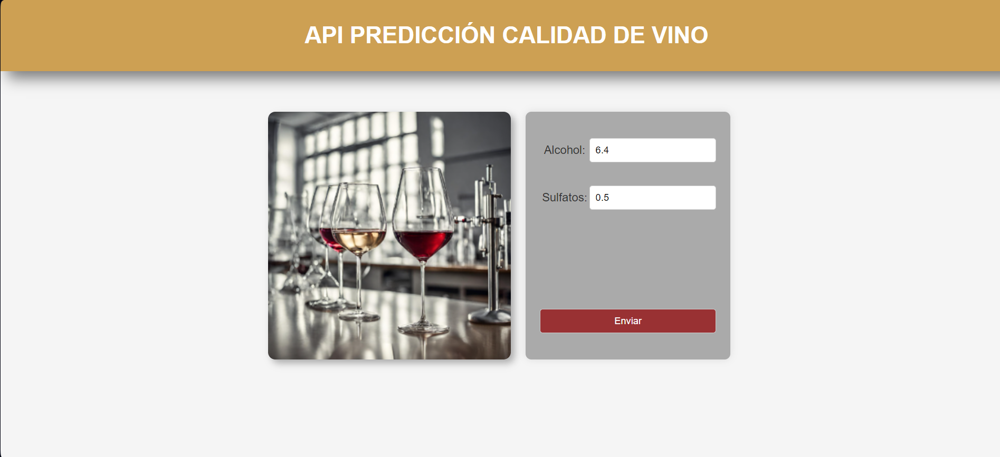
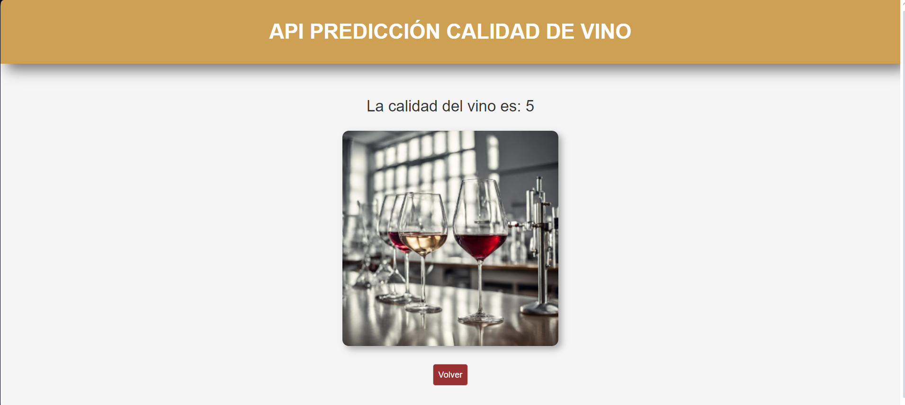

# API REST - PREDICCIÓN CALIDAD DEL VINO

## Contenidos
[1. Objetivo](#1-objetivo-predicción-de-la-calidad-del-vino)
[2. Funcionalidades](#2-funcionalidades)
[3. Recursos](#3-recursos)
[4. Uso con API](#4-uso-con-api)
[5. Uso con interfaz gráfica](#5-uso-con-interfaz-gráfica)

### 1. Objetivo: Predicción de la calidad del vino

Este proyecto es una aplicación web desarrollada con Flask que permite predecir la calidad de un vino a partir de dos parámetros: el alcohol y los sulfatos. El proyecto usa un modelo de aprendizaje automático entrenado con un conjunto de datos de vinos portugueses.

[subir](#contenidos)
### 2. Funcionalidades

- El usuario puede introducir los valores de alcohol y sulfatos de un vino mediante un formulario web.
- La aplicación calcula la calidad del vino usando el modelo de aprendizaje automático y muestra el resultado en una nueva página.

[subir](#contenidos)
### 3. Recursos 

- Python 3.11
- Flask 2.0.2
- Pickle 4.0
- Un archivo llamado _wine_model.pkl_ que contiene el modelo de aprendizaje automático.

[subir](#contenidos)
### 4. Uso con API
- Para usar la API, acceder a la dirección `http://localhost:5000/winequality?alcohol=valor&sulphates=valor`, donde valor es el número que se quiere usar como parámetro.
- Ver el resultado de la predicción de la calidad del vino en formato JSON.

[subir](#contenidos)
### 5. Uso con interfaz gráfica
- Ejecutar el archivo main.py.
- Abrir un navegador web y acceder a la dirección `http://localhost:5000/`.
- Introducir los valores de alcohol y sulfatos de un vino y pulsar el botón "Enviar".

- Resultado de la predicción.

## Autora
Virginia Ordoño Bernier
Enero 2024