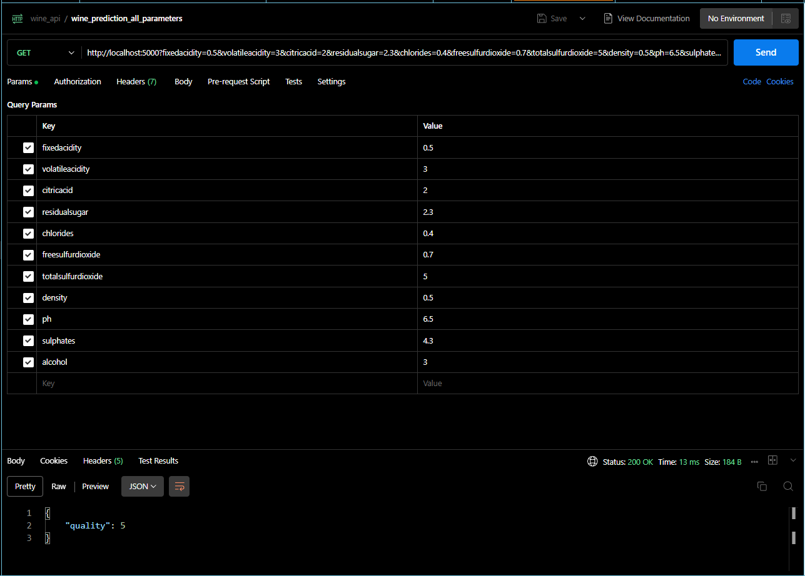

# API REST - PREDICCIÓN CALIDAD DEL VINO

## Contenidos
[1. Objetivo](#1-objetivo-predicción-de-la-calidad-del-vino)
[2. Recursos](#2-recursos)
[3. Uso con API](#3-uso-con-api)

### 1. Objetivo: Predicción de la calidad del vino

Este proyecto es una aplicación web desarrollada con Flask que permite predecir la calidad de un vino a partir de una serie de características. El proyecto usa un modelo de aprendizaje automático entrenado con un conjunto de datos de vinos portugueses.

[subir](#contenidos)
### 2. Recursos 

- Python 3.11
- Flask 2.0.2
- Pickle 4.0
- Un archivo pickle que contiene el modelo de aprendizaje automático.

[subir](#contenidos)

### 3. Uso con API
- Tras ejecutar el programa principal, acceder a la API con los valores correspodientes:
- Ver el resultado de la predicción de la calidad del vino en formato JSON.

[subir](#contenidos)

## Autora
Virginia Ordoño Bernier
Enero 2024