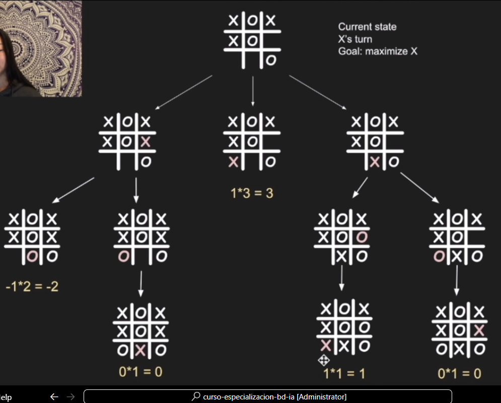
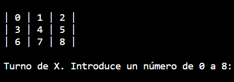

# Tic-Tac-Toe-AI

Este proyecto es una recreación del juego Tic Tac Toe basado en un tutorial de YouTube. 

## Créditos
  - Canal: [freeCodeCamp.org](enlace_al_video)
  - Creadora: Kylie Ying
  - Enlace al video: [12 Beginner Python Projects - Coding Course](https://www.youtube.com/watch?v=8ext9G7xspg&t=14s)

## Índice 
[1. Introducción](#1-introducción)

### 1. Introducción
Este repositorio contiene una implementación de un juego Tic Tac Toe en Python, con la particularidad de que uno de sus jugadores es la máquina.

En este juego, el __algoritmo minimax__ será la clave para garantizar que la máquina nunca pierda en el juego, siempre ganando o empatando. El algoritmo Minimax es un algoritmo de toma de decisiones utilizado en juegos de dos jugadores con información perfecta y de suma cero, lo que significa que en cada movimiento, el beneficio de un jugador es exactamente igual a la pérdida del otro jugador. El objetivo del algoritmo Minimax es encontrar el mejor movimiento para el jugador que maximiza su beneficio y minimiza el beneficio del oponente. Simula movimientos de manera recursiva.

En el contexto de juegos como el tic-tac-toe, donde hay un número finito de movimientos posibles y el juego termina en un número finito de pasos, el algoritmo Minimax busca explorar todas las posibles secuencias de movimientos y evaluar cuál sería el resultado de cada secuencia. La idea fundamental es que cada jugador asume que el oponente tomará la mejor decisión posible en cada movimiento.

Otro elemento fundamental será la __función de utilidad__, la cual mide la valía del resultado final en el árbol de decisiones del juego. Su objetivo es la optimización para ganar en la menor cantidad de pasos posibles. 

Se han implementado dos versiones: una por consola y otra con interfaz gráfica

### 2. Funcionamiento Tic Tac Toe por consola

Al ejecutar el programa, se muestra un tablero de 3 x 3 y cuyas casillas contienen en número correspondiente. Esa información se facilita al usuario para saber cómo tiene que elegir la casilla donde quiera poner su ficha.

#### player.py

__Clase Player__
Representar un jugador en el juego.

##### __init__()
Inicializa una instancia de la clase _Player_ con una letra asignada al jugador ('X' o 'O').

##### get_move()
Método abstracto que debe ser implementado por las subclases. Representa el movimiento que realizará el jugador en el juego.

__Clase HumanPlayer__
La clase HumanPlayer hereda de la clase base _Player_ y representa a un jugador humano que realiza movimientos a través de la entrada del usuario.

##### __init__(self, letter)
El constructor de la clase HumanPlayer llama al constructor de la clase base con la letra asignada al jugador.

##### get_move(self, game)
Solicita al usuario ingresar un número del 0 al 8, verificando la validez del movimiento antes de devolverlo.

__Clase GeniusComputerPlayer__
La clase GeniusComputerPlayer hereda de la clase base _Player_ y representa a un jugador máquina que utiliza el algoritmo minimax para tomar decisiones.

##### __init__()
Llama al constructor de la clase base con la letra asignada al jugador.

##### get_move()
Implementa la lógica para que la máquina realice movimientos inteligentes utilizando el algoritmo minimax.

##### minimax(self, state, player)
El método minimax es una función recursiva que evalúa el estado del juego y devuelve la mejor posición y puntaje posible para el jugador actual utilizando el algoritmo minimax.

##### Flujo del algoritmo minimax:
- Verifica si el último movimiento resultó en un ganador o empate.
- Asigna valores de puntaje basados en la situación del juego.
- Explora todas las posibles jugadas y selecciona la mejor opción utilizando recursión.
- Este algoritmo permite que la máquina tome decisiones óptimas para maximizar su ventaja o minimizar su desventaja, considerando todas las posibles líneas de juego.

#### game.py

##### __init__()
En resumen, la función __init__ inicializa una instancia de la clase TicTacToe con un tablero vacío y sin un ganador inicial. 

##### print_board()
En cada iteración se crea una lista de sublistas, donde cada sublista representa una fila del tablero. Luego, el bucle for recorre cada fila y las imprime en el formato deseado.

##### print_board_nums()
Imprime un tablero inicial de 3x3 con números del 0 al 8.
Cada número representa una posición en el tablero, ofreciendo una referencia visual para los jugadores.

##### available_moves()
Devuelve una lista con los índices de aquellas casilla que están vacías. Esta información será útil para cuando tengamos que comproabr la disponibilidad de una casilla.

##### empty_squares()
Devuelve _true_ si al menos hay una casilla vacía. Esta función será útil para determinar si el juego sigue o no, cada vez que se produzca un movimiento. Para el algoritmo minimax, es crucial determinar si el juego ha llegado a su fin (victoria o empate) durante la simulación de los movimientos.

##### num_empty_squares()
Devuelve el número exacto de casillas que quedan libres. El número de casillas vacías podría influir en la evaluación de la utilidad. Por ejemplo, podría considerarse un estado mejor si hay más casillas vacías disponibles, ya que eso significa más oportunidades para el jugador. Conocer la cantidad exacta de casillas vacías serviría para identificar rápidamente estados terminales o situaciones donde no es necesario explorar más movimientos puede mejorar la eficiencia del algoritmo, lo cual es fundamental para el algoritmo minizax.

##### make_move()
Comprueba si el último movimiento es válido, en cuyo caso lo imprime. Después comprueba si ese movieminto ha resultado en ganador. Si lo es, guarda el ganador en una variable.

Flujo de la función:
- Validación del Movimiento.
> Se verifica si la casilla especificada por _square_ en el tablero está vacía, en cuyo caso el movimiento se considera válido y se procede. En caso contrario la función devuelve False.
- Asignación del Movimiento.
> Si el movimiento es válido, se asigna el símbolo _letter_ a la casilla especificada por square en el tablero.
- Verificación de Ganador.
> Llamando a la función _winner_, verifica si el movimiento ha llevado a que alguien gane el juego. En ese caso, se actualiza el atributo _current_winner_ con el símbolo del ganador.
Resultado de la Función.
> Devuelve _True_ si el movimiento es válido y se ha realizado correctamente y _False_ si el movimiento no es válido.

##### winner()
Comprueba si el último movimiento es ganador, haciendo una verificación de las filas, columnas y diagonales en busca de tres símbolos consecutivos del mismo jugador.

Flujo de la función:
- Obtención de la Fila.
> Calcula el índice de fila (row_ind) dividiendo la posición square entre 3 (la cantidad de columnas en el juego). Luego, extrae la fila correspondiente del tablero utilizando slicing (self.board[row_ind*3 : (row_ind + 1) * 3]).

- Verificación de Ganador en la Fila.
> Comprueba si todos los elementos en la fila son iguales al símbolo del jugador que hizo el último movimiento. Si es así, la función retorna True, indicando que hay un ganador en esa fila.

- Obtención de la Columna:
> Calcula el índice de columna (col_ind) tomando el residuo de _square_ entre 3. Luego, extrae la columna correspondiente del tablero utilizando una _comprehension list_.  

- Verificación de Ganador en la Columna:
> Similar a la verificación de fila, comprueba si todos los elementos en la columna son iguales a __letter__. Si es así, la función retorna True, indicando que hay un ganador en esa columna.

- Verificación de Diagonales.
> Si la posición square es un número par (índice par), entonces verifica las diagonales. Para la diagonal izquierda a derecha, comprueba si los elementos en las posiciones 0, 4 y 8 son iguales a letter. Para la diagonal derecha a izquierda, comprueba si los elementos en las posiciones 2, 4 y 6 son iguales a letter. Si alguna de estas condiciones es verdadera, la función retorna True.

- Sin Ganador.
> Si ninguna de las condiciones anteriores es verdadera, la función retorna False, indicando que no hay un ganador después del último movimiento.

##### play()
Coordina todo el juego, permite que los jugadores realicen movimientos de manera alterna, actualiza el tablero y verifica si hay un ganador o un empate.

Flujo de la función:
- Impresión del Tablero Inicial.
- Se establece la letra inicial en 'X'.
- Mientras haya casillas vacías, se sigue jugando.
- Obtención del Movimiento del Jugador Actual. 
- Se obtiene el movimiento del jugador actual (x_player o o_player) según la letra actual (letter).
- Realización del Movimiento.
- Impresión del Estado Después del Movimiento:
- Verificación de Ganador:
- Cambio de Jugador:
- Pausa.
- Fin del Juego - Empate.
> Si no hay más casillas vacías y no hay un ganador, se imprime un mensaje de empate.
- Retorno del Resultado.
> Retorna None si hay un empate y no hay ganador. 
> Retorna la letra del ganador si alguien ha ganado.